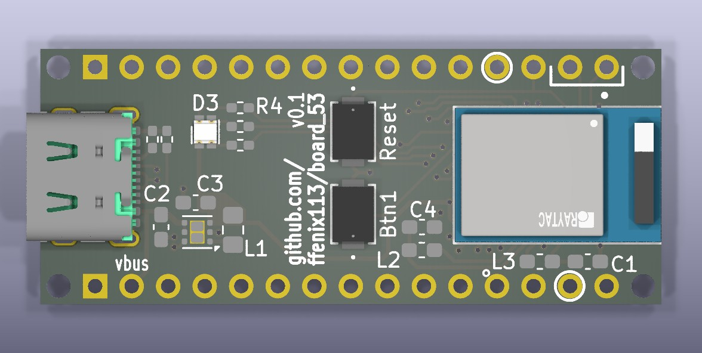
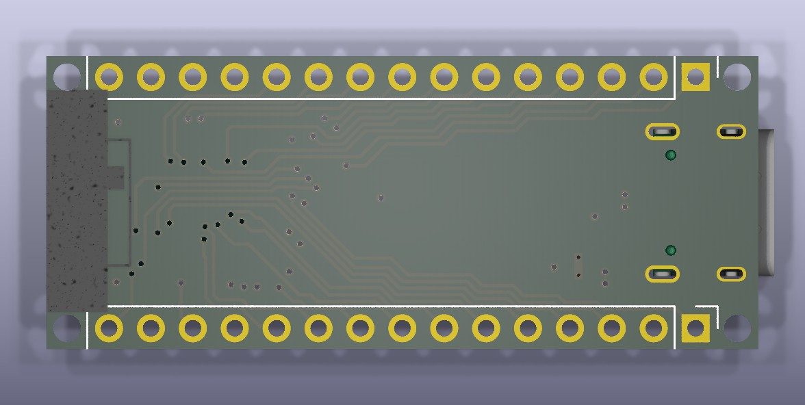

# board_53

An Arduino Nano-sized board based on [nRF5340](https://www.nordicsemi.com/Products/nRF5340).
Idea is to have modern and accessible alternative to a sea of nRF52840 boards.

## Features
* Similar, but not identical, pinout to [Arduino Nano 33 BLE](https://docs.arduino.cc/hardware/nano-33-ble/).
* Based on Raytac [MDBT53-1M](https://www.raytac.com/product/ins.php?index_id=121) (nRF5340).
* USB-C connector.
* RGB LED.
* Uses TI [TPS62291](https://www.ti.com/lit/ds/symlink/tps62293.pdf) for better efficiency. This also allows to use batteries in 2.3-6.0 V range (no on-board charger).
* Two buttons: Reset & User configurable.
* SWD pins on the edges.
* Chip antena for better wireless.
* Rather easy to solder this board at home.

## Notes
1. This board is not (yet?) available in Zephyr. Zephyr board definition from this repository should be used when building for this board.
2. Board will be revisioned to improve & simplify design.
3. Buck converter is used to improve efficiency, but maybe will be converted for LDO in next revisions.
4. Bootloader is not required, but MCUBoot can be used as one. UF2 bootloader is not currently (15 Dec, 2024) available for nRF53.
5. There are 0402 resistors in revision 0.1, which will be replaced by 0603(or even 0804) in next revision for easier placing & soldering.

## Contact
* For issues and proposals please use Issues.
* For direct contact please use: board_53@ffenix113.addy.io
